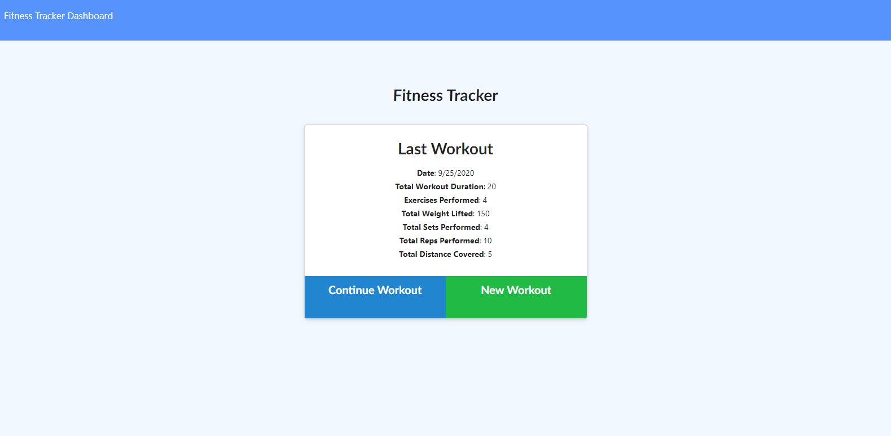

# Workout-Mongo

For this App, I was asked to use a Mongo database, Mongoose schema, and express. Some client-side code was provided, as was the user story. 
In addition to Mongo, Mongoose, and Express, Morgan and path are employed, and the site is deployed on Heroku via mongodb Atlas.

## User Story (Provided to me)

* As a user, I want to be able to view create and track daily workouts. I want to be able to log multiple exercises in a workout on a given day. I should also be able to track the name, type, weight, sets, reps, and duration of exercise. If the exercise is a cardio exercise, I should be able to track my distance traveled.

## Starter Code
all client-side code was provided to me as starter code. All server-side code is my own. 

## Deployment

The site can be [viewed here](https://tranquil-reaches-02659.herokuapp.com/?id=5f6ea4d35f0b560017ab71dc)

## Usage
Users can either create a new workout or continue a previous workout. After making that selection, users will be prompted to select if their excercise was cardio or resistance based. After a user enters the information about their workout, they can either add a new excercise, or complete their workout. Selecting Dashboard in the upper left corner will take the user to a page that tracks and displays their excercise data.

